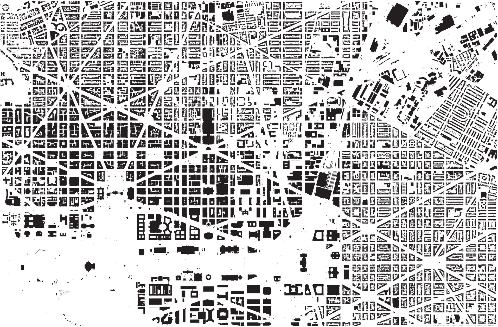
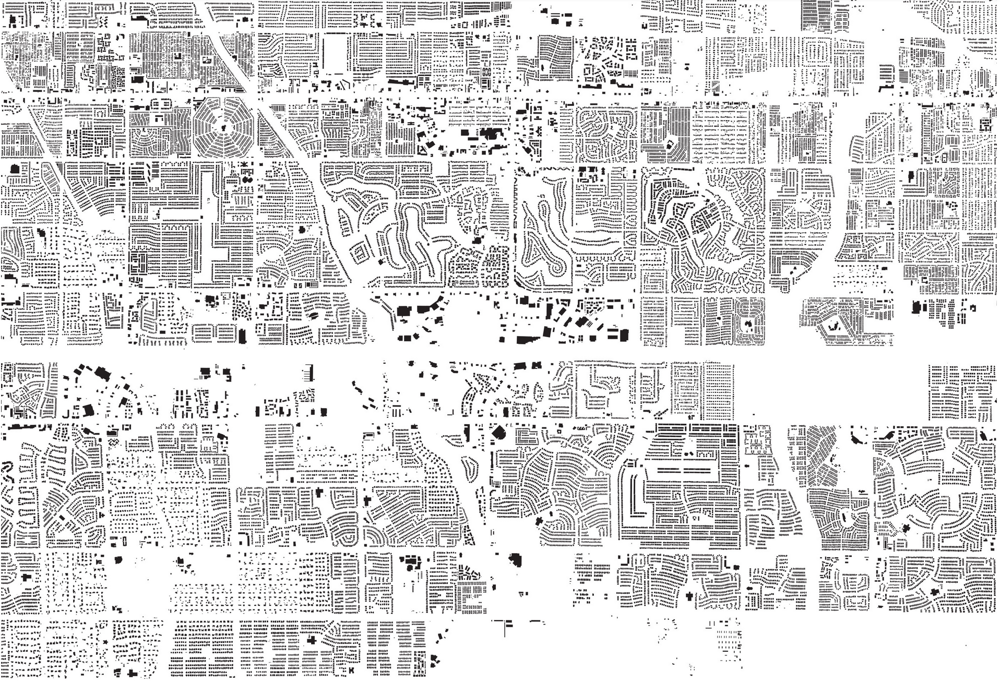
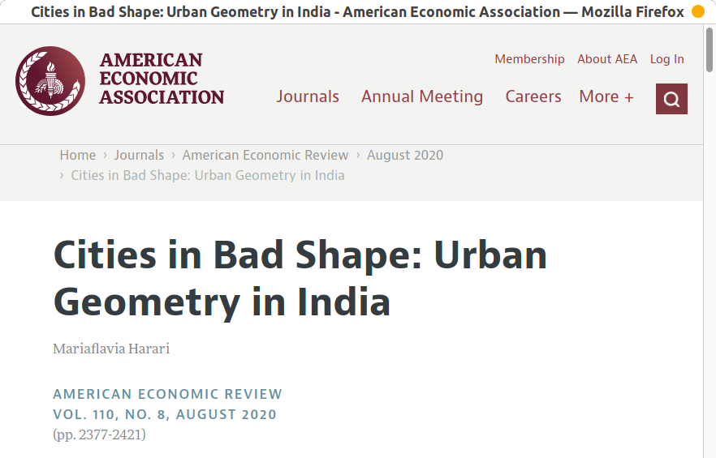

# *Spatial Signatures*

    *Capturing the Structure of Cities with Data Science*

<table>
    <col width="100%">
    <tr>
        <td>
            

                <a href="https://martinfleischmann.net/"><b>Martin Fleischmann</b></a>
            

        </td>
    </tr>
    <tr>
        <td>
            

                <a href="https://twitter.com/martinfleis">[`@martinfleis`]</b></a>
            

        </td>
    </tr>
</table>

<table>
    <col width="50%">
    <col width="50%">
    <tr>
        <td>
            
        </td>
        <td>
            
        </td>
    </tr>
</table>

#
## How we arrange "stuff" in cities matters...

<table>
    <col width="50%">
    <col width="50%">
    <tr>
        <td>
            

                
            

        </td>

        <td>
            

                
            

        </td>
    </tr>
</table>

Source: *A map of every building in America* ([New York
    Times](https://www.nytimes.com/interactive/2018/10/12/us/map-of-every-building-in-the-united-states.html))

##

... it matters *a lot*

<table>
    <col width="33%" height="50%">
    <col width="33%" height="50%">
    <col width="33%" height="50%">
    <tr>
        <td>
            

                
            

        </td>

        <td>
            

                
            

        </td>

        <td>
            

                
            

        </td>
    </tr>
    <tr class='fragment'>
        <td>
            

                
            

        </td>

        <td>
            

                
            

        </td>

        <td>
            

                
            

        </td>
    </tr>
</table>

#
## Urban Form

    *What does it look like?*

    
        "Physical structure and appearance of cities"
    

## What do we talk about...

    
        ... when we talk about urban morphology?
    

 
<table>
    <col width="25%">
    <col width="25%">
    <col width="25%">
    <col width="25%">
    <tr>
        <td style="vertical-align:middle">
            

                
                    buildings
                
            

        </td>
        <td style="vertical-align:middle">
            

                
                    streets
                
            

        </td>
        <td style="vertical-align:middle">
            

                
                    plots
                
            

        </td>
        <td style="vertical-align:middle">
            

                
                    open spaces
                
            

        </td>
    </tr>
</table>

## How can we describe it...

    
        ... numerically?
    

## Urban morphometrics

    
        "quantitative analysis of urban form"
    

 

    
        All about measuring.
    

## Measuring

<table>
    <col width="33%">
    <col width="33%">
    <col width="33%">
    <tr>
        <td style="vertical-align:middle">
            

                
                    dimension
                
            

        </td>
        <td style="vertical-align:middle">
            

                
                    shape
                
            

        </td>
        <td style="vertical-align:middle">
            

                
                    spatial distribution
                
            

        </td>
    </tr>
    <tr>
        <td style="vertical-align:middle">
            

                
                    intensity
                
            

        </td>
        <td style="vertical-align:middle">
            

                
                    connectivity
                
            

        </td>
        <td style="vertical-align:middle">
            

                
                    diversity
                
            

        </td>
    </tr>
</table>

## Why?

    
        Because we (finally) can!
    

## Data

    
        
    

## Tools
<table>
    <col width="25%">
    <col width="25%">
    <col width="25%">
    <col width="25%">
    <tr>
        <td>
            

                
                    OSMnx
                
            

        </td>
        <td>
            

                
                    PySAL
                
            

        </td>
        <td>
            

                
                    foot
                
            

        </td>
        <td>
            

                
                    momepy
                
            

        </td>
    </tr>
</table>

## momepy

    
        Urban Morphology Measuring Toolkit
    
    <small>
Member of a PySAL family
</small>

    
        <a href="https://momepy.org">momepy.org</a> & <a href="https://pysal.org">pysal.org</a>
    

