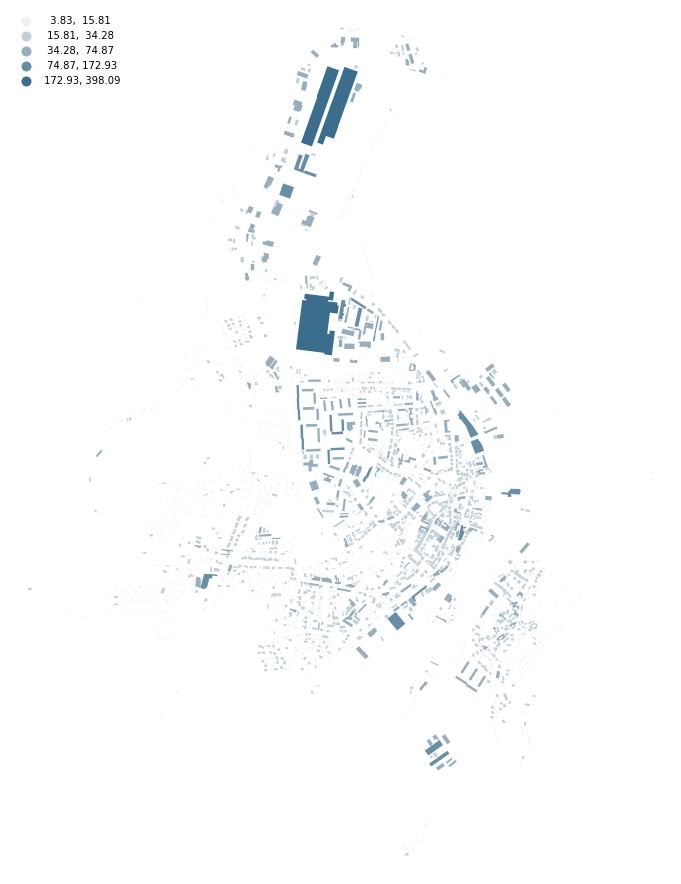
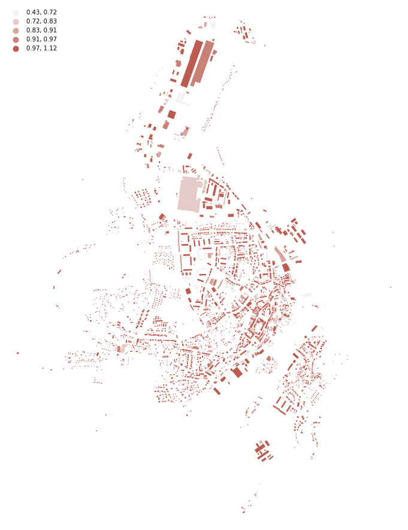
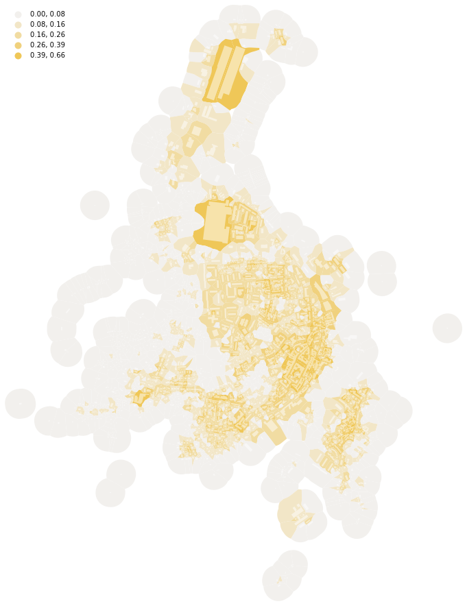
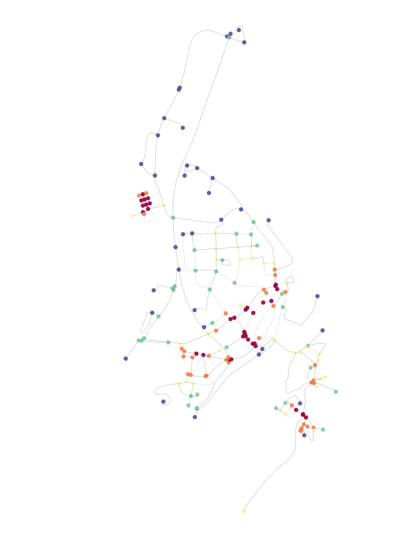
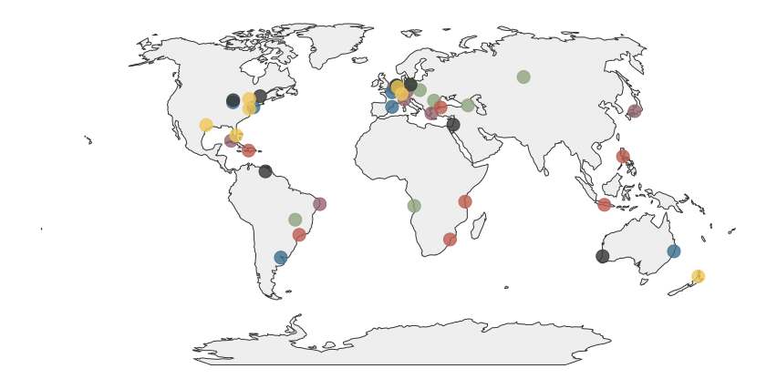

# *Urban morphology as an open reproducible data science*

 

    *Martin Fleischmann*

 
<table>
    <col width="100%">
    <tr>
        <td>
            

                <a href="https://twitter.com/martinfleis">@martinfleis</a>
            

        </td>
    </tr>
    <tr>
        <td>
            

                <a href="https://martinfleischmann.net">martinfleischmann.net</a>
            

        </td>
    </tr>
</table>

#
## Urban Form

     *What does a city look like?*

    
        "Physical structure and appearance of cities"
    

## What do we talk about...

    
        ... when we talk about urban morphology?
    

 
<table>
    <col width="25%">
    <col width="25%">
    <col width="25%">
    <col width="25%">
    <tr>
        <td style="vertical-align:middle">
            

                
                    buildings
                
            

        </td>
        <td style="vertical-align:middle">
            

                
                    streets
                
            

        </td>
        <td style="vertical-align:middle">
            

                
                    plots
                
            

        </td>
        <td style="vertical-align:middle">
            

                
                    open spaces
                
            

        </td>
    </tr>
</table>

## How can we describe it...

    
        ... numerically?
    

## Urban morphometrics

    
        "quantitative analysis of urban form"
    

 

    
        All about measuring.
    

## Measuring

<table>
    <col width="33%">
    <col width="33%">
    <col width="33%">
    <tr>
        <td style="vertical-align:middle">
            

                
                    dimension
                
            

        </td>
        <td style="vertical-align:middle">
            

                
                    shape
                
            

        </td>
        <td style="vertical-align:middle">
            

                
                    spatial distribution
                
            

        </td>
    </tr>
    <tr>
        <td style="vertical-align:middle">
            

                
                    intensity
                
            

        </td>
        <td style="vertical-align:middle">
            

                
                    connectivity
                
            

        </td>
        <td style="vertical-align:middle">
            

                
                    diversity
                
            

        </td>
    </tr>
</table>

## Why?

    
        Because we (finally) can!
    

## Data

    
        
    

#
## Tools
<table>
    <col width="33%">
    <col width="33%">
    <col width="33%">
    <tr>
        <td>
            

                
                    GeoPandas
                
            

        </td>
        <td>
            

                
                    PySAL
                
            

        </td>
        <td>
            

                
                    momepy
                
            

        </td>
    </tr>
</table>

## GeoPandas

    
        GeoPandas is an open source project to add support for geographic data to pandas objects.
    

 

    
        <a href="https://geopandas.org">geopandas.org</a>
    

## PySAL

    
        Python Spatial Analysis Library
    

 

    
        <a href="https://pysal.org">pysal.org</a>
    

## momepy

    
        Urban Morphology Measuring Toolkit
    

 

    
        <a href="https://momepy.org">momepy.org</a>
    

#
## Few examples

##

<table>
    <col width="50%">
    <col width="50%">
    <tr>
        <td>
            

                
                <SMALL>
                    longest axis length 
                    dimension
                </SMALL>
            

        </td>
        <td>
            

                
                    
                    <SMALL>
                        equivalent rectangular index 
                        shape
                    </SMALL>
                
            

        </td>
    </tr>
</table>

##

<table>
    <col width="50%">
    <col width="50%">
    <tr>
        <td>
            

                
                <SMALL>
                    distance to neighbours 
                    spatial distribution
                </SMALL>
            

        </td>
        <td>
            

                
                    
                    <SMALL>
                        covered area ratio 
                        intensity
                    </SMALL>
                
            

        </td>
    </tr>
</table>

##

<table>
    <col width="50%">
    <col width="50%">
    <tr>
        <td>
            

                
                <SMALL>
                    closeness centrality 
                    connectivity
                </SMALL>
            

        </td>
        <td>
            

                
                    
                    <SMALL>
                        Simpson's diversity of tessellation area 
                        diversity
                    </SMALL>
                
            

        </td>
    </tr>
</table>

#
## Evolution of urban patterns

## 42 places, 6 historical periods

    

## 400 m buffer

    

## Scale peaked in modernism

    

## We forgot how to make a grid

    

#
## Classification

## Detection of patterns

    

Prague

## Spatial Signatures

*A characterisation of space based on form and function designed to understand urban environments*

## {data-transition="none" data-background-image="../fig/sp_sig/barcelona_signatures_and_buildings_background.png"
data-background-size="contain"}

Barcelona

## {data-transition="none" data-background-image="../fig/sp_sig/houston_medellin_background.png"
data-background-size="contain"}

Houston | Medellin

## {data-transition="none" data-background-image="../fig/sp_sig/singapore_dar_es_salaam_background.png"
data-background-size="contain"}

Singapore | Dar es Salaam

#
## Reproducible open science

    

# *Urban morphology as an open reproducible data science*

 

    *Martin Fleischmann*

 
<table>
    <col width="100%">
    <tr>
        <td>
            

                <a href="https://twitter.com/martinfleis">@martinfleis</a>
            

        </td>
    </tr>
    <tr>
        <td>
            

                <a href="https://martinfleischmann.net">martinfleischmann.net</a>
            

        </td>
    </tr>
</table>
