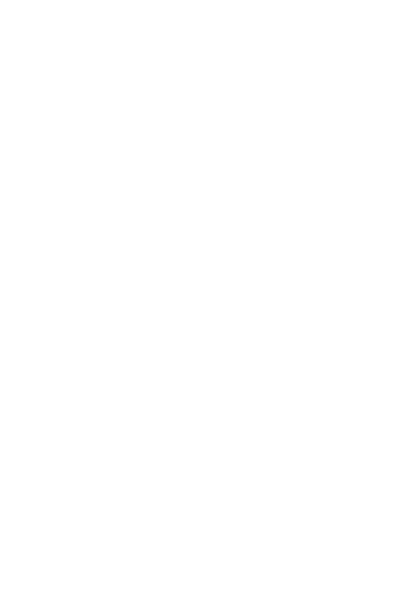
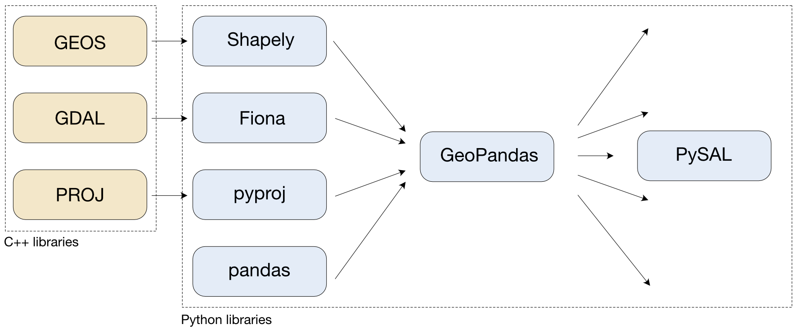

# A Gentle Introduction to Spatial Data in the Pandas Ecosystem
#### Martin Fleischmann
---
## Who am I?

A brief intro to ensure I have the credibility to talk about the stuff. 
---
### Researcher

Fellow at GDSL
PostDoc at Urrlab

### Open-source developer

You'll learn during the talk about my work :)

### Data scientist

Head of Data and analytics at Urban Data Lab AG

---
```py
import pandas as pd
``` 
# Starting point
---
```py
import pandas as pd
``` 
## Is this enough?
```
           name   latitude   longitude
0  Vatican City  41.903282   12.453387
1    San Marino  43.936096   12.441770
2         Vaduz  47.133724    9.516669
3    Luxembourg  49.611660    6.130003
4       Palikir   6.916644  158.149974
```
---
# No, it is not!
--- 
```py
import geopandas as gpd
``` 
# Let's bring geo
---
```py
import geopandas as gpd
``` 
## This looks better
```
           name                   geometry
0  Vatican City  POINT (12.45339 41.90328)
1    San Marino  POINT (12.44177 43.93610)
2         Vaduz   POINT (9.51667 47.13372)
3    Luxembourg   POINT (6.13000 49.61166)
4       Palikir  POINT (158.14997 6.91664)
```
---
# A bit of theory
---
## Geo
## Geographic
## Spatial
## Geospatial

All these terms mean very similar things.

---
# Raster data
---


Source: National Ecological Observatory Network (NEON)
---
## We're not going to talk about raster.
---
# Vector data
---
## Points
## Lines
## Polygons
 




---
## We're going to talk about vector.
---
# Back to GeoPandas
---
### GeoPandas glues the ecosystem together
---
# What do we need to work with geospatial data?
---
## Geospatial input/output
```py
cities = geopandas.read_file(path, engine="pyogrio")

cities = geopandas.read_file(path, engine="fiona")
```
---
## Geometry
```py
>>> cities.geometry.head()
0    POINT (12.45339 41.90328)
1    POINT (12.44177 43.93610)
2     POINT (9.51667 47.13372)
3     POINT (6.13000 49.61166)
4    POINT (158.14997 6.91664)
Name: geometry, dtype: geometry
```
```py
>>> type(cities.geometry.loc[0])
shapely.geometry.point.Point
```
---
```py
>>> ny_boroughs.geometry.head()
0    MULTIPOLYGON (((970217.022 145643.332, 970227....
1    MULTIPOLYGON (((1029606.077 156073.814, 102957...
2    MULTIPOLYGON (((1021176.479 151374.797, 102100...
3    MULTIPOLYGON (((981219.056 188655.316, 980940....
4    MULTIPOLYGON (((1012821.806 229228.265, 101278...
Name: geometry, dtype: geometry
```
```py
>>> type(ny_boroughs.geometry.iloc[0])
shapely.geometry.multipolygon.MultiPolygon
```
---
## Coordinate reference system
### Where on Earth is this?
```py
>>> ny_boroughs.crs
<Derived Projected CRS: EPSG:2263>
Name: NAD83 / New York Long Island (ftUS)
Axis Info [cartesian]:
- X[east]: Easting (US survey foot)
- Y[north]: Northing (US survey foot)
Area of Use:
- name: United States (USA) - New York - counties of Bronx; Kings; Nassau; New York; Queens; Richmond; Suffolk.
- bounds: (-74.26, 40.47, -71.8, 41.3)
Coordinate Operation:
- name: SPCS83 New York Long Island zone (US Survey feet)
- method: Lambert Conic Conformal (2SP)
Datum: North American Datum 1983
- Ellipsoid: GRS 1980
- Prime Meridian: Greenwich
```
```py
>>> type(ny_boroughs.crs)
pyproj.crs.crs.CRS
```
---


Mike Bostock and D3 - https://observablehq.com/@d3/projection-transitions
---
## Data


---
```py
>>> isinstance(ny_boroughs, geopandas.GeoDataFrame)
True
>>> isinstance(ny_boroughs, pandas.DataFrame)
True
>>> isinstance(ny_boroughs.geometry, geopandas.GeoSeries)
True
>>> isinstance(ny_boroughs.geometry, pandas.Series)
True
```
---



---
# What can GeoPandas do?

---
# Demo time!
---

# @martinfleis
## martin@martinfleischmann.net
