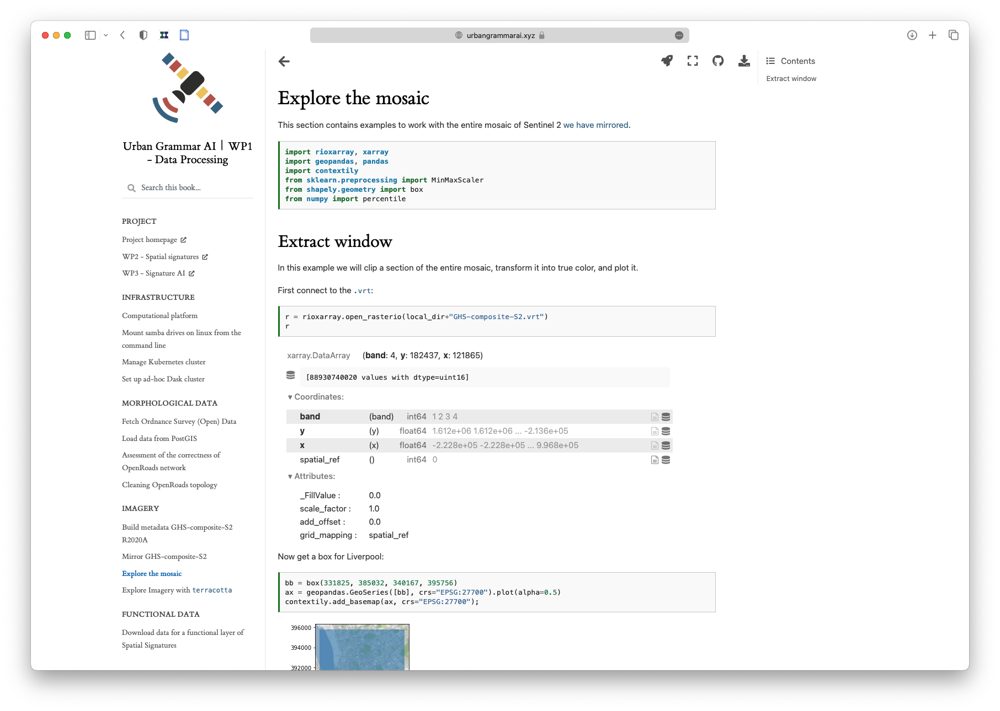

# Geographic Data Science
###### Martin Fleischmann
---
## Who am I?

A brief intro to ensure I have the credibility to talk about the stuff. 
---
### Researcher

Fellow at GDSL
PostDoc at Urrlab

---
### Open-source developer

GeoPandas, PySAL and the PyData ecosystem
---
### Data scientist

Head of Data and analytics at Urban Data Lab AG

---
## Researcher
### Where do I come from?
How did I get here?
---
# Architect
#### Czech Technical University
Originally an architect here from CTU.
---
# Urban Designer
#### University of Strathclyde
Masters in Glasgow, at Strathclyde
---
# Geographer
#### University of Strathclyde
Stayed for a doctorate
---
# Geographic Data Scientist?
#### University of Liverpool
Post-doctoral position
---
## Open-source developer
### What do I use and write? 
A bit about tools
---
# GeoPandas
#### Python tools for geographic data

General geospatial data handling
---
# PySAL
#### Python Spatial Analytics Library
Spatial statistics, modelling, esda...
---
# PyData ecosystem
General tools to work with spatial data in various ways
---
## Data Scientist
### Who is interested?
Is it just a weird niche? Nope.
---
# UrbanDataLab AG
#### Swiss startup providing location intelligence
Data-based startup, working with clients like insurance, local authorities, police.
---
# The Alan Turing Institute
#### The UK's national institute for AI and data science.
They have a whole institute for these things!
---
## What is geographic data science?
Geographic data science is an interdisciplinary field that combines concepts, theories, and methods from geography, computer science, statistics, and data science to study spatial and spatiotemporal phenomena.

Geographic data scientists work with a variety of spatial datasets, including satellite imagery, geographic information systems (GIS) data, and location-based data from sensors and mobile devices. They use computational tools and techniques to explore, analyze, and visualize these datasets to uncover patterns, relationships, and insights about the spatial world.

Geographic data science can be applied to a wide range of topics, such as urban planning, environmental monitoring, epidemiology, transportation, and social inequality. It plays a critical role in decision-making processes for government, non-profit organizations, and businesses, as it provides a data-driven understanding of spatial phenomena and supports evidence-based policy-making.
---
### Spatial data science
### Geospatial data science
### Geographic data science
Terminology is a bit mixed
---
# Data Science that understands space

Geographic data science is an interdisciplinary field that combines concepts, theories, and methods from geography, computer science, statistics, and data science to study spatial and spatiotemporal phenomena.

---
### Quantitative geography
### GIScience
Similar fields, or different ways of categorising the same
---
# Different
## Data
## Tools
## Methods
## Culture

---
### Reproducibility
### Open science
### Open tools
### Open (big?) data
Cultural shift
---
# Show me!
Detailed exploration of my projects falling under GDS
---
## Case 1
# Methodological Foundation of a Numerical Taxonomy of Urban Form

My PhD
---
# Code

Code not always is. Less than data.

---
# Paper
Paper is a standard academic output.

---
# Data

Data should be. 

---
# Maps

Maps are nice and helpful

==Jump to maps here==
---
# Tools

We built tools to do stuff. So we released them. For free.

---
# Policy documents

Prague got interested. We did the same for them.
---

# Non-expert outputs

We turned it into a story.

==Jump to the StoryMap here.==

---
## Case 2
# Urban Grammar AI

Case of a bigger project.
---
## Website

Everything documented as you go.
---
## Code 

Code available as it gets written.

---
## Papers

There are papers, as always.
---
## Papers

---
## Papers

---
## Papers

---
## Data
## Tools
## Maps
## Talks
## Tutorials

All the other outputs are also part of it. Plus quite some more.

---
## Non-expert outputs

The non-expert explanation.

==Jump to the UG site==
---
# All is open
---
## Case 3
# Private company
---
### Using open tools
### Consuming open data
---
#### Rent price prediction
#### Life insurance value prediction
#### Retail location choice
#### Crime level prediction
----
### Interfacing data science
---
# Some may be open
### Tools most likely are!
---
# Python, R, SQL
---
## Open source is open science
---
# Limits
---
### Data
### Nuances of human geography
### Detachment
---
# Ethics
---
### Privacy concerns
### Discrimination
### Bias confirmation
---
# Geographic data science
---
## In academia
### Mindset
### Methods
### Tools

---
## In industry
### ~~Mindset~~
### Methods
### Tools

---
# @martinfleis
## martinfleischmann.net
## martin@martinfleischmann.net
