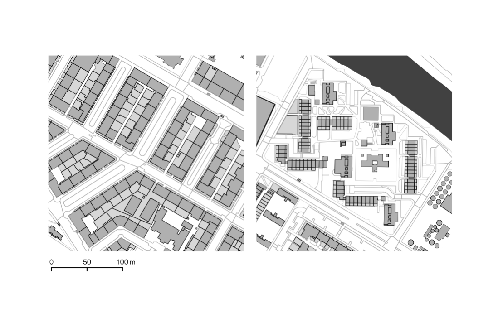
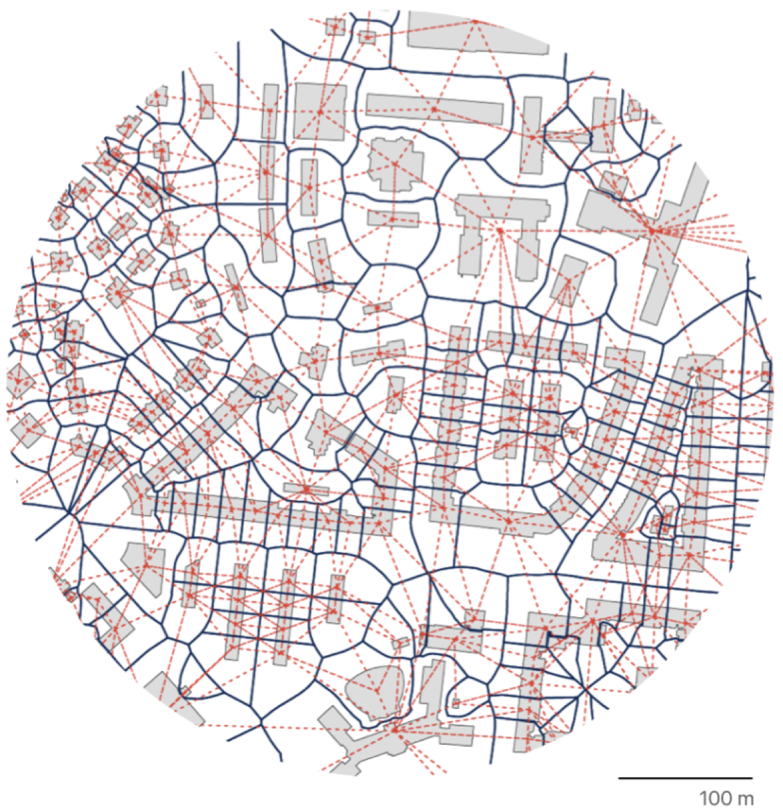
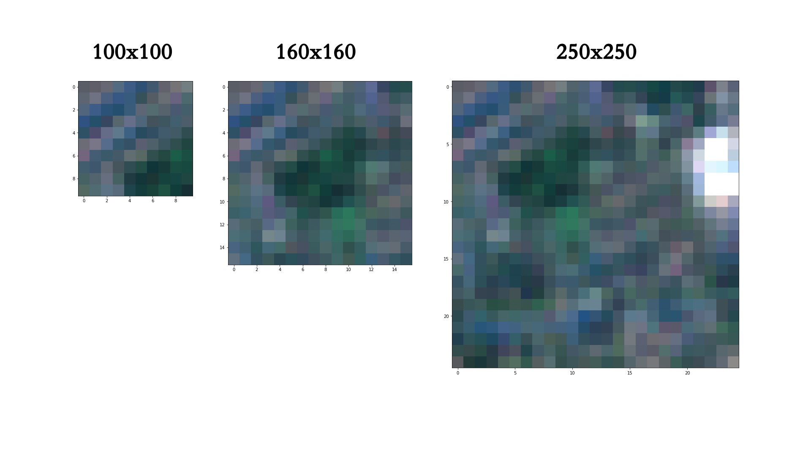

# Urban morphology drawn and seen
# *Martin Fleischmann* (@martinfleis)
---
## Who am I?
---
### Researcher
---
### Open-source developer
---
### Data scientist
---
## Researcher
### Where do I come from?
---
# Architect
#### Czech Technical University
---
# Urban Designer
#### University of Strathclyde
---
# Geographer
#### University of Strathclyde
---
# Geographic Data Scientist?
#### University of Liverpool
---
# Geographic Data Scientist
#### Charles University
---
## Open-source developer
### What do I use and write? 
---
# GeoPandas
#### Python tools for geographic data

---
# PySAL
#### Python Spatial Analytics Library

---
# PyData ecosystem

---
## Data Scientist
### Who is interested?
---
# UrbanDataLab AG
#### Swiss startup providing location intelligence

---
# The Alan Turing Institute
#### The UK's national institute for AI and data science.

---
## Urban Morphology
---
## Drawn
---
# From cadastral data to classification of urban form[^Fleischmann, M., Feliciotti, A., Romice, O. and Porta, S. ‘Methodological Foundation of a Numerical Taxonomy of Urban Form.’ Environment and Planning B: Urban Analytics and City Science 49 (4), 1283-1299. doi:10.1177/23998083211059835]

---
# Plot
# Building
# Street network
---

---
## Morphological Tessellation

---

---

---

---

---

---

---

---

---

---

---

---

---

---

---

---

---
# Structural complexity

## Dimension
## Shape
## Spatial distribution
## Intensity
## Connectivity
## Diversity
---
# Scalar complexity

## Individual elements
## Immediate relations
## Contextual relations
---

## 

---

---
# 74 characters
# 4 ways of capturing spatial lag
---
# 296 characters for clustering
---
## martinfleis.github.io/numerical-taxonomy-maps

---
## Seen & drawn
---
# From aerial data to classification of urban form[^Wang, J., Fleischmann, M., Venerandi, A., Romice, O., Kuffer, M., and Porta, S. ‘EO + Morphometrics: Understanding cities through urban morphology at large scale’ Landscape and Urban Planning, 233. doi:10.1016/j.landurbplan.2023.104691]
---

---

---

---

---

---

---

---

---

---

---

---

---

---
## Seen

---
# From satellite data to classification of urban form[^Singleton, A., Arribas-Bel, D., Murray, J., and Fleischmann, M. ‘Estimating generalized measures of local neighbourhood context from multispectral satellite images using a convolutional neural network.’ Computers, Environment and Urban Systems, 95, 101802. doi:10.1016/j.compenvurbsys.2022.101802]

---

---

---
## 

---

---
# Classification

---
# With vector data, we can be precise
---
# With raster data, we can approximate
---
# Either by detecting footprints of lower quality
---
# Or by working with imagery directly
---
# Either way, we learn something new about cities.
---
# *Martin Fleischmann* (@martinfleis)
