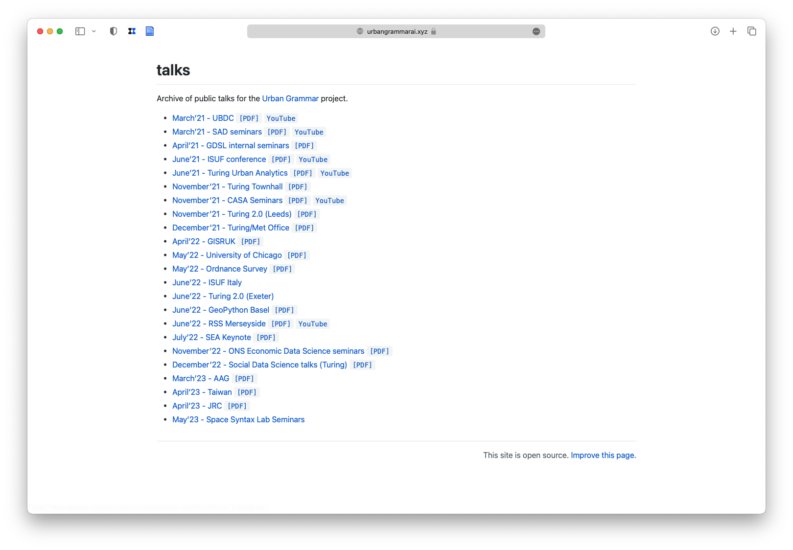

# Open by Default
###### Martin Fleischmann, Dani Arribas-Bel
###### 2023-06-07 @ ORNL
---
## *Open by default*

	Use (and nurture) the *existing* OSS infrastructure
	Treat research artifacts as OSS from Day 1
	Only "stay closed" when there is a good reason
---
## *Reproducible research*
	1. Transparent
	1. Accessible
	1. Transferrable
---
## For example
---

---
# Urban Grammar
### A characterisation of ==space== based on ==form and function== designed to understand ==urban environments==
---

---
## Needs
---
# The kitchen
	Data, data, data
	(New) methods, (new) code
	Infrastructure

---

# The sausage
	(Academic) dissemination
	Open Data Products
	Journaling/reporting
---
## The kitchen
---
## Data

	Standard (formats) better than niche
	Open better than proprietary
	Static better than DB
---
## Data
### For example 

	Apache (Geo)Parquet
	FlatGeobuf
	Cloud Optimised GeoTiff
	NetCDF
	Zarr
---
## New methods
---

---

---
## New code

---

---

---

---

## Infrastructure
---

---

---
# Let's have a closer look
---

---
## ... and the "sausage"
---
## Dissemmination (I): Papers

---
## Dissemmination (II): Talks

---

## Dissemmination (II): Talks

---
## Dissemmination (III): Other

---
## Dissemmination (III): Other

---
## Dissemmination (III): Other

---
## Open Data Products (I): Data

---
## Open Data Products (II): Exploratory tools

---
## Open Data Products (II): Exploratory tools

---
# The takeaway
---
## *Release early, release often*
---
## *Make open a feature, not a bug*
---
## *Share your knowledge, it is a way to achieve immortality* 
	(Dalai Lama)
---
# A bit more to read

	Rey, S., Arribas-Bel, D., & Wolf, L. (*in press*). Computational Tools for Geographic Data Science. Chapter 2 in *Geographic Data Science with Python*. Available at: [https://geographicdata.science](https://geographicdata.science/book/notebooks/02_geospatial_computational_environment.html)
	
	Boeing, G., & Arribas-Bel, D. (2021). GIS and Computational Notebooks. *Geographic Information Science & Technology Body of Knowledge*, 2021(Q1).
	
	Arribas-Bel, D., Green, M., Rowe, F., & Singleton, A. (2021). Open data products-A framework for creating valuable analysis ready data. *Journal of Geographical Systems*, 23(4), 497-514.
	
	 [https://urbangrammarai.xyz](https://urbangrammarai.xyz) 
---
# Open by Default
###### Martin Fleischmann, Dani Arribas-Bel
###### @martinfleis, @darribas

