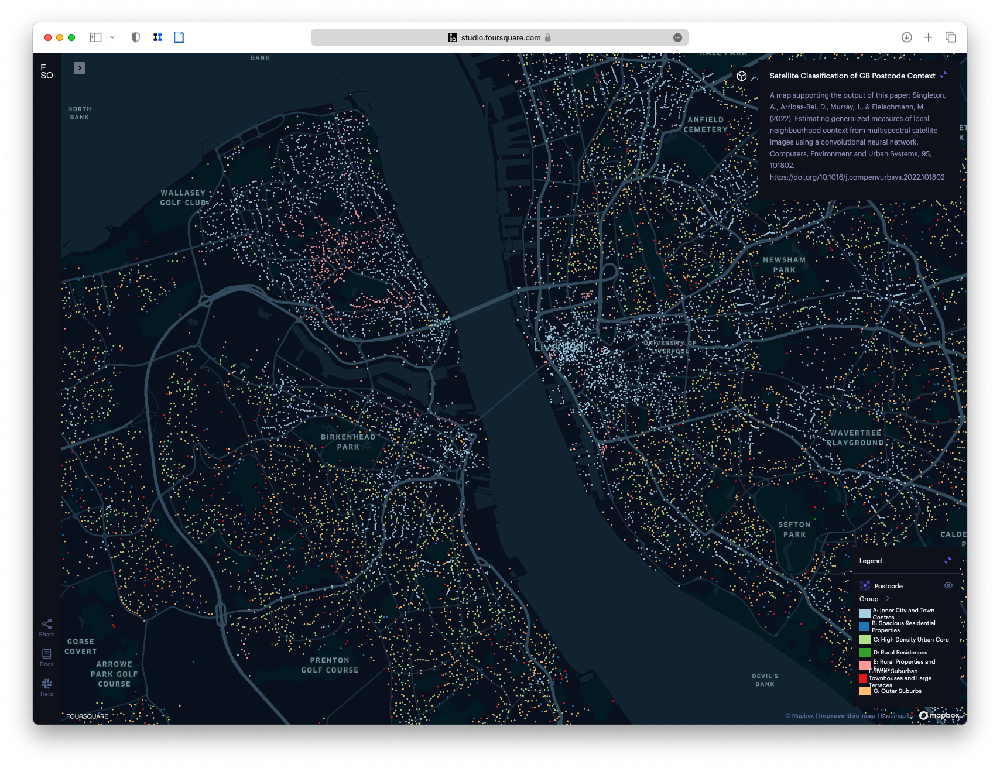

# Data Science a AI pro čtení města
# *Martin Fleischmann* (@martinfleis)
---
## Kdo jsem?
---
# Architekt
#### FA ČVUT
---
# Urban Designer
#### University of Strathclyde
---
# Urbánní geograf
#### University of Strathclyde
---
# Datový urbánní geograf
#### University of Liverpool
---
# Datový urbánní geograf
#### Univerzita Karlova
---
# The Alan Turing Institute
#### The UK's national institute for AI and data science.
---
## Co je data science a co je AI?
---

---
## Více statistika než AI
---
# Od katastru ke struktuře[^Fleischmann, M., Feliciotti, A., Romice, O. and Porta, S. ‘Methodological Foundation of a Numerical Taxonomy of Urban Form.’ Environment and Planning B: Urban Analytics and City Science 49 (4), 1283-1299. doi:10.1177/23998083211059835]

---
# Parcela
# Budova
# Uliční síť
---

---
## Morphological Tessellation

---

---
## 

---

---
# 296 měřitelných atributů
---
##  [martinfleis.github.io/numerical-taxonomy-maps](https://martinfleis.github.io/numerical-taxonomy-maps) 

---

##  [storymaps.arcgis.com/stories/12bf3e7625cd45519200eac7aa09916e](https://storymaps.arcgis.com/stories/12bf3e7625cd45519200eac7aa09916e) 

---
# Od leteckého snímku přes budovy ke struktuře[^Wang, J., Fleischmann, M., Venerandi, A., Romice, O., Kuffer, M., and Porta, S. ‘EO + Morphometrics: Understanding cities through urban morphology at large scale’ Landscape and Urban Planning, 233. doi:10.1016/j.landurbplan.2023.104691]
---

---

---

---

---

---

---

---

---

---

---

---

---

---
# Od satelitního snímku ke struktuře[^Singleton, A., Arribas-Bel, D., Murray, J., and Fleischmann, M. ‘Estimating generalized measures of local neighbourhood context from multispectral satellite images using a convolutional neural network.’ Computers, Environment and Urban Systems, 95, 101802. doi:10.1016/j.compenvurbsys.2022.101802]

---

---

---
## 

---

---
##  [https://studio.foursquare.com/public/c40f0a5b-a1f8-48af-8b7d-7c258942cf0d](https://studio.foursquare.com/public/c40f0a5b-a1f8-48af-8b7d-7c258942cf0d) 

---
# Pokud máme katastrální data, umíme být přesní
---
# Pokud máme snímky, můžeme se přiblížit realitě
---
# Buď použijeme AI pro detekci budov
---
# Nebo ji necháme číst strukturu přímo
---
# Pokaždé však umm jen ten jeden úkol.
---
# Je to tedy AI?
---
# *Martin Fleischmann* (@martinfleis)
