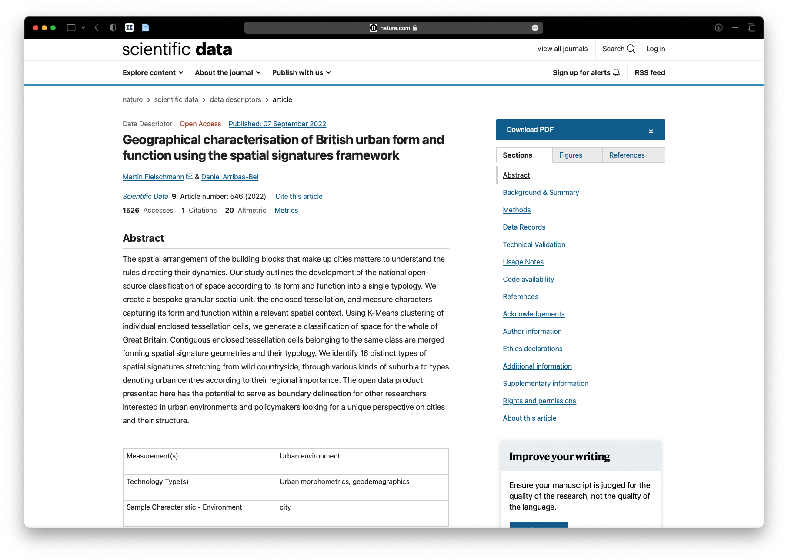

# Open by Default
---
### Martin Fleischmann
#### Charles University

---
##  Developing reproducible, computational research
---
## *Open by default*

### Use (and nurture) the *existing* OSS infrastructure
### Treat research artifacts as OSS from Day 1
### Only "stay closed" when there is a good reason
---
## *Reproducible research*

## Transparent
## Accessible
## Transferrable
---
## Example
# Urban Grammar AI
---
## A characterisation of space based on form and function designed to understand urban environments
---
## *Needs*

# Ingredients and tools

# Letting people know
---

## *Ingredients and tools*

### Data, data, data
### (New) methods, (new) code
### Infrastructure

---
## Data

### Standard (formats) better than niche
### Open better than proprietary
### Static better than database

---
## Methods and code

### Contribution first
### Reusability matters
### Reproducibility as well
---
## Contribution first

---
## Reusability matters

---
## Release readable code 

---
## Release reproducible code 

---
## Infrastructure

### Ensure others can use the same
### Reproducible environments
### Containers

---
## Infrastructure

---
## *Letting people know*

### (Academic) dissemination
### Open Data Products
### Journaling/reporting
---
## Website

---
## Papers

---
## Papers

---
## Papers

---
## Papers

---
## Open Data Products

---
## Open Data Products

---
## Non-expert outputs

---

## Tutorials

---
## Talks

---
# The takeaway
---

## *"Release early, release often"*
---
## Make open a feature, not a bug
---
## Do what is best, not what system wants
---
## *Share your knowledge, it is a way to achieve immortality* 
#### (Dalai Lama)
