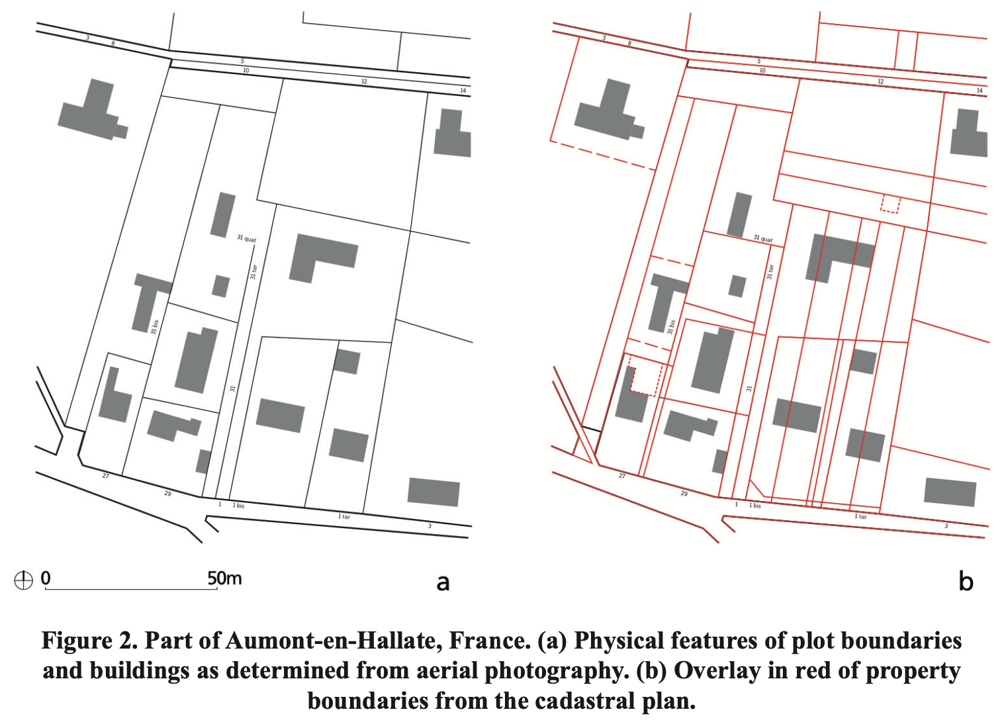
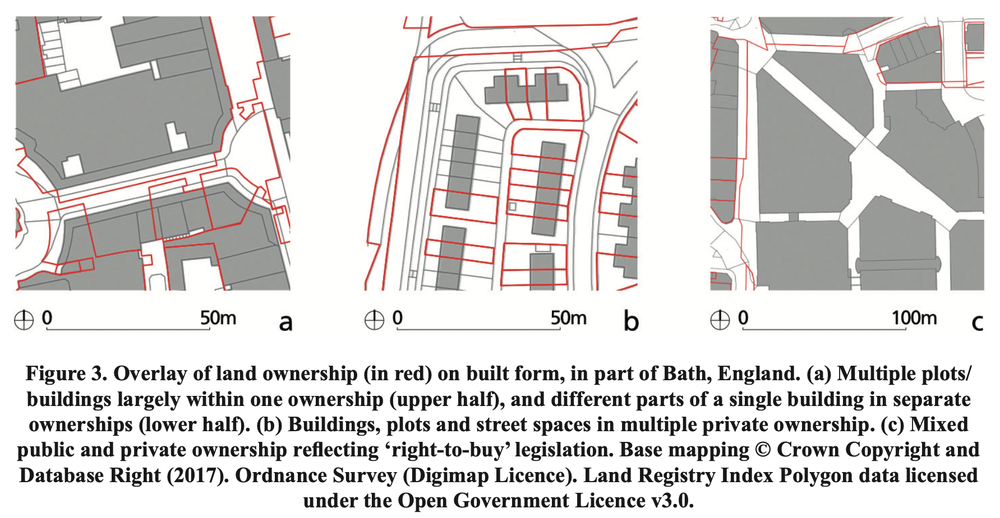
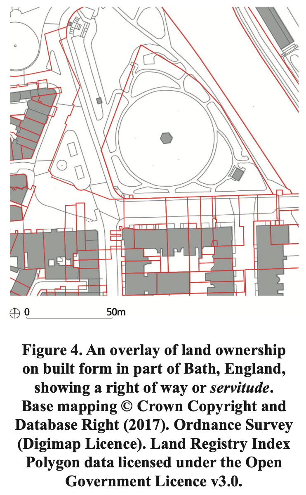
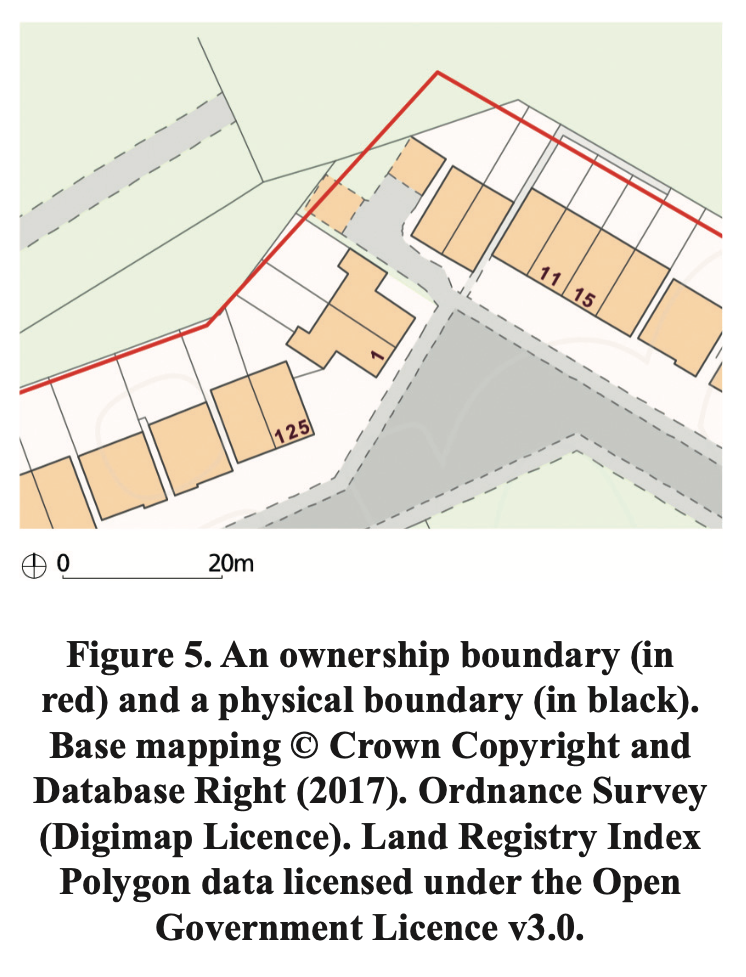

# Plot
# Lot
# What?
---
## The plot is one of the ==fundamental elements== of urban form within the field of urban morphology.
---
## plot (also referred to as 'parcel', 'property' or 'lot')
Bobkova
---
## There is ==no== clear ==consensus== on the definition of the plot or lot. 
---
## In common usage a plot is a ==small== piece or ==area of land==
---
## a parcel of land representing a ==land-use== unit defined by boundaries on the ground
Conzen
---
## the ‘module’ of urban tissue and is constituted by the ==built area== and what they refer to as the ==pertinent area== (*area di pertinenza*) which is the open area for the use of the inhabitants associated with the building
Caniggia and Maffei
---
## a unit of ==property==, describing the initial and subsequent subdivision of land into parcels for sale and occupation
Moudon
---
## once an ==area of land==, an area of land with some ==buildings== on it, a ==land-use== unit, and a unit of ==property==
---
## One of the contributing factors in the ambiguity of the term plot is the fact that there are very few commonly used ==terms== for a plot as a solely ==physical entity==. 

## ==This is not to say there are none.==
---
## there is a sufficiently close ==correspondence== between the three aspects of physical form, property and use
---
# *Is there?*
---
## the relation between property boundaries and physical boundaries is fundamentally ==variable==
---
# 

---
# 

---
# 

---
# 

---
## property boundaries are ==not fixed== in any strict, physical way to physical boundaries
---
## property boundaries are a ==socially agreed== set of spatial limits on ==behaviour==
---
## To adequately understand the role of property boundaries as part of a plan analysis, the boundaries need to be represented graphically as a ==separate== drawing or ==layer==. 
Physical and property boundaries
---
# *So, what is a plot?*
---
# *Does plot exist in modernist urban fabric?*
---
# *Is there anything we know?*
---
# *What is a building?*
---
# *What about translations?*
---
### *plot == parcela?*
---
### *budova == building?*
---
### *city == město?*
---
### *town == město?*
---
### *neighbourhood == ???*
---
# *Shall we stick to 'terms'?*
---
# *Or use them flexibly alongside an applied definition?*
---
# *When is a 'term' untouchable?*
---
# *When to come up with a new term?*
